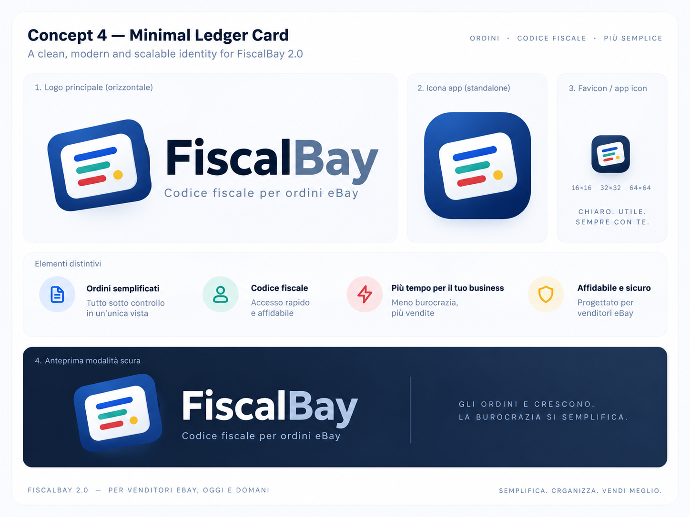
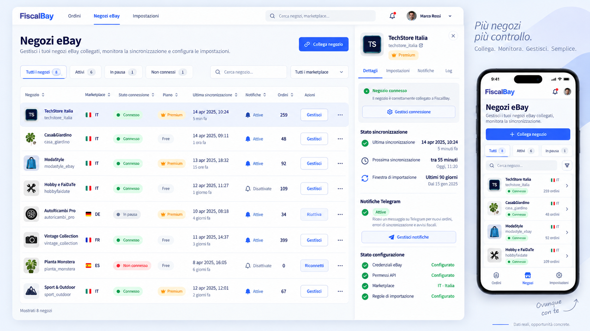

# Riferimenti visivi e regole di integrazione

**Stato:** concept direzionali approvati, non asset definitivi né specifica pixel-perfect. Gli originali sono identificati nel [manifest](references/manifest.json); verificarli con `node scripts/verify-docs.mjs --assets`. Produrre le rifiniture in file separati, senza sovrascriverli.

Il Master Plan prevale per contenuti, piani, date, stati, funzioni e navigazione. Un testo comparso in un concept non introduce un requisito: niente cronologia ordini, fatturazione eBay, app native 2.0, layout a schede in tutte le sezioni o paginazione numerata soltanto perché apparsi nell’immagine.

## Riferimenti approvati

### Logo: Concept 4 originale

Unico riferimento principale. Bay da grigio a blu del fondo; bordo destro esterno blu continuo/regolare, senza cambiare tessera, inclinazione, composizione e quattro accenti.

Origine: `concept_fiscalbay_identità_moderna_e_minimale.png`.

### Ordini: due schede per riga

Riferimento di formato e gerarchia. Comportamenti veri: top nav 3 destinazioni, Carica altri, drawer senza cronologia, sblocco per ordine; i dati dimostrativi non sono specifiche.

Origine: `dashboard_fiscalbay_con_ordini_e_app_mobile.png`.

### Negozi: elenco strutturato

Lista/righe con pannello e stati, non griglia di schede. Il piano appartiene allo spazio, non a ogni negozio; eventuali etichette errate nel concept non diventano requisiti.

Origine: `dashboard_fiscalbay_negozi_ebay_ovunque.png`.

### Impostazioni: categorie e contenuto

Categorie a sinistra e contenuto a destra, mobile elenco→dettaglio. Export è una sezione operativa; profilo/avatar e campanella seguono le decisioni finali.

Origine: `impostazioni_fiscalbay_desktop_e_mobile.png`.

## Rifinitura del logo — M0/M1

Partire dal **Concept 4 originale** incluso, non da una delle rigenerazioni successive respinte. Correggere soltanto le imperfezioni note e rifinire tecnicamente la geometria. La scritta `Bay` deve essere blu come il riquadro del simbolo, non grigia; il bordo destro del riquadro blu esterno deve essere continuo e regolare dal raccordo superiore a quello inferiore. Preservare il resto della direzione approvata; niente nuova reinterpretazione automatica.

Prima di dichiararlo definitivo, sottoporre all’owner la versione vettoriale a confronto con l’originale e prove a dimensioni piccole, scuro/chiaro e monocromo. Produrre SVG/PNG per sito, app bar, favicon, Telegram, con griglia/margini/varianti coerenti. Non copiare eventuali date/hex/tagline dimostrative del board come fonte normativa. Il marchio resta FiscalBay; `FB` è solo interno. Il logo deve rimanere autonomo e non far credere a un prodotto ufficiale eBay.

## Nove riferimenti frontend

| Riferimento | Uso previsto nella fase frontend |
|---|---|
| `beautifului.dev` | Ispirazione e singoli elementi visivi/interattivi pertinenti, senza aggiungere funzioni AI al prodotto. |
| `beui.dev` | Interazioni, rifiniture e componenti candidati. |
| `rareui.com` | Componenti e animazioni selettive, mai catalogo completo. |
| `transitions.dev` | Linguaggio del movimento, con condizioni d’uso del singolo materiale. |
| `ui.shadcn.com` | Fondazione tecnica e sorgenti dei componenti personalizzabili. |
| `ui-skills.com` | Metodo di lavoro/review, non dipendenza runtime. |
| `coss.com/ui` | Componenti candidati, con verifica per file/sottoprogetto delle licenze. |
| `designsystemchecklist.com` | Checklist di coerenza del design system. |
| `reui.io/components` | Componenti applicativi candidati; distinguere gratuito e materiale Pro incompatibile col Git pubblico. |

**Non è stato compilato adesso il catalogo dei componenti da installare.** Tale lavoro appartiene alla milestone frontend, come richiesto. shadcn non deve monopolizzare la direzione estetica; gli altri riferimenti sono parte del brief, non decorazione bibliografica.

## Procedura di selezione

Il componente deve risolvere una funzione approvata. Valutare origine, licenza/versione, manutenzione, dipendenze, bundle, supporto tastiera/touch, focus, IT/EN, tema chiaro/scuro, reduced motion e compatibilità con le dimensioni della schermata. Provare dati lunghi, più articoli, errori, accesso fiscale bloccato e letture parziali, non soltanto una schermata perfetta.

Registrare i componenti copiati nel registro terze parti anche quando non compaiono in `package.json`. Per ciascuno: URL/commit originale, percorso locale, licenza, avvisi da preservare, modifiche sostanziali, motivo e test pertinenti. Preferire una base coerente di primitive; evitare di sovrapporre più kit per ottenere lo stesso menu o dialog.

Token semantici e regole di dominio sono riutilizzabili in React Native/Expo 3.x. L’HTML/CSS dei registry web non diventa componente nativo: non sacrificare il web o introdurre WebView pur di dichiarare riuso totale.
